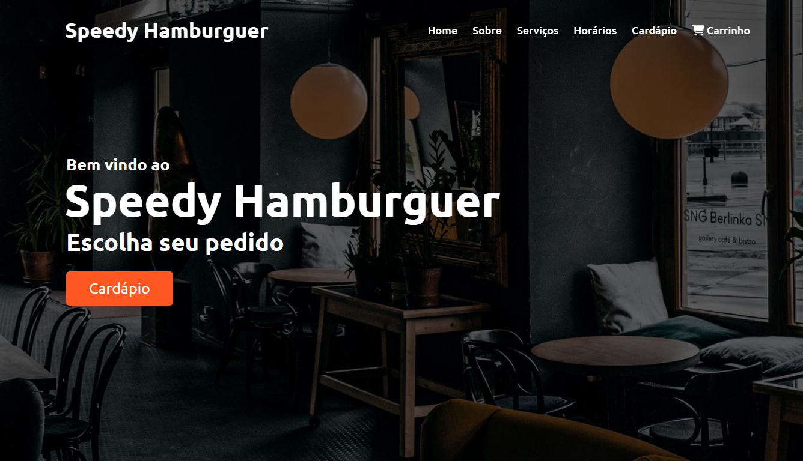

<h1 align="center">Speedy Hamburguer</h1>

<p align="center">
  
</p>

## 📒 Descrição

<p>
  Este projeto é uma lanchonete virtual com pedidos pelo whatsapp. O Speedy Hamburguer é uma aplicação web projetada para facilitar o sistema de delivery. Nesta lanchonet os clientes podem checar o cardápio online, escolher o produto, adicionar ao carrinho e enviar os pedidos pelo whatsapp, simplificando a vida do cliente e do fornecedor.
</p>

## 📚 Funcionalidades

- [x] Adiciona ao carrinho o produto desejado
- [x] Produtos ficam salvos na sessionStorage
- [x] Envia o pedido via WhatsApp usando uma API

## 🔧 Tecnologias utilizadas

- HTML
- CSS
- JavaScript
- Jquery
- API do WhatsApp

## 💻 Pré-requisitos

Antes de começar, verifique se você atendeu aos seguintes requisitos:

- Você tem uma máquina `<Windows / Linux / Mac>`

## 🚀 Como Executar o Projeto

```bash
# clonar o repositório
$ git clone https://github.com/pedrodev30/speedy-hamburguer.git

# vai entrar na pasta do projeto
$ cd speedy-hamburguer

# abrir a pasta do projeto no seu editor
$ Abra a pasta no Visual Studio Code ou editor de sua Preferência

# Live Server é uma extensão do Vs Code que executa o arquivo no seu navegador
$ Agora abra o arquivo index.html com o live Server
```
 
## 🤝 Colaboradores

<table>
  <tr>
    <td align="center">
      <a href="https://github.com/JonasA1ves">
        <br>
        <sub>
          <b>Jonas Alves</b>
        </sub>
      </a>
    </td>
    <td align="center">
      <a href="https://github.com/pedrodev30">
        <br>
        <sub>
          <b>Pedro Henrique</b>
        </sub>
      </a>
    </td>
    <td align="center">
      <a href="https://github.com/Pedrinhous12">
        <br>
        <sub>
          <b>Pedro Venícius</b>
        </sub>
      </a>
    </td>
    <td align="center">
      <a href="https://github.com/RbmrJnr">
        <br>
        <sub>
          <b>Ribamar Junior</b>
        </sub>
      </a>
    </td>
  </tr>
</table>

## 🎯 Status do projeto

O projeto está em finalizado.

## :memo: Licença

Esse projeto está sob a licença MIT. Veja o arquivo [LICENSE](https://github.com/pedrodev30/speedy-hamburguer/blob/main/LICENSE) para mais detalhes.